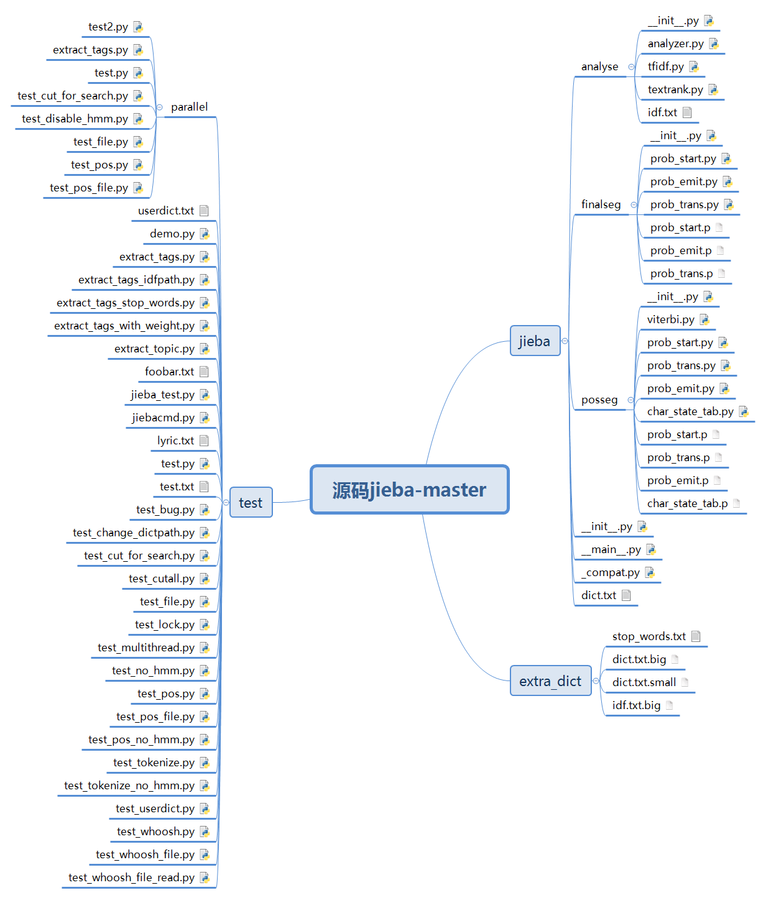

# jieba_parsing

##  1、jieba基本功能总结

### 1.1 jieba.test.demo模块展示的功能如下


```python
from __future__ import unicode_literals

import jieba
import jieba.posseg
import jieba.analyse
```


```python
print('='*40)
print('1. 分词')
print('-'*40)
```

    ========================================
    1. 分词
    ----------------------------------------
    


```python
seg_list = jieba.cut("我来到北京清华大学", cut_all=True)
print("Full Mode: " + "/ ".join(seg_list))  # 全模式
```

    Building prefix dict from the default dictionary ...
    Loading model from cache C:\Users\86185\AppData\Local\Temp\jieba.cache
    Loading model cost 1.158 seconds.
    Prefix dict has been built successfully.
    

    Full Mode: 我/ 来到/ 北京/ 清华/ 清华大学/ 华大/ 大学
    


```python
seg_list = jieba.cut("我来到北京清华大学", cut_all=False)
print("Default Mode: " + "/ ".join(seg_list))  # 默认模式
```

    Default Mode: 我/ 来到/ 北京/ 清华大学
    


```python
seg_list = jieba.cut("他来到了网易杭研大厦")
print(", ".join(seg_list))
```

    他, 来到, 了, 网易, 杭研, 大厦
    


```python
seg_list = jieba.cut_for_search("小明硕士毕业于中国科学院计算所，后在日本京都大学深造")  # 搜索引擎模式
print(", ".join(seg_list))
```

    小明, 硕士, 毕业, 于, 中国, 科学, 学院, 科学院, 中国科学院, 计算, 计算所, ，, 后, 在, 日本, 京都, 大学, 日本京都大学, 深造
    


```python
print('='*40)
print('2. 添加自定义词典/调整词典')
print('-'*40)
```

    ========================================
    2. 添加自定义词典/调整词典
    ----------------------------------------
    


```python
print('/'.join(jieba.cut('如果放到post中将出错。', HMM=False)))
```

    如果/放到/post/中将/出错/。
    

Signature: jieba.suggest_freq(segment, tune=False)
Docstring:
Suggest word frequency to force the characters in a word to be
joined or splitted.
* 建议词频，以迫使一个词中的字符连接或分裂。

Parameter:
    - segment : The segments that the word is expected to be cut 
    into,If the word should be treated as a whole, use a str.
            
    - tune : If True, tune the word frequency.调单词频率。

Note that HMM may affect the final result. If the result doesn't change,
set HMM=False.

注意，HMM可能会影响最终结果。如果结果不变，则设置HMM=False。


```python
print(jieba.suggest_freq(('中', '将'), True))
```

    494
    


```python
print('/'.join(jieba.cut('如果放到post中将出错。')))
```

    如果/放到/post/中/将/出错/。
    


```python
print('/'.join(jieba.cut('如果放到post中将出错。', HMM=False)))
```

    如果/放到/post/中/将/出错/。
    


```python
print('/'.join(jieba.cut('「台中」正确应该不会被切开', HMM=False)))
```

    「/台/中/」/正确/应该/不会/被/切开
    


```python
#「/台/中/」/正确/应该/不会/被/切开
print(jieba.suggest_freq('台中', True))
```

    69
    


```python
tokenizer.FREQ.get('台中')
```


    3


```python
print('/'.join(jieba.cut('「台中」正确应该不会被切开', HMM=False)))
```

    「/台中/」/正确/应该/不会/被/切开
    


```python
print('='*40)
print('3. 关键词提取')
print('-'*40)
print(' TF-IDF')
print('-'*40)
```

    ========================================
    3. 关键词提取
    ----------------------------------------
     TF-IDF
    ----------------------------------------
    


```python
s = "此外，公司拟对全资子公司吉林欧亚置业有限公司增资4.3亿元，增资后，吉林欧亚置业注册资本由7000万元增加到5亿元。吉林欧亚置业主要经营范围为房地产开发及百货零售等业务。目前在建吉林欧亚城市商业综合体项目。2013年，实现营业收入0万元，实现净利润-139.13万元。"
for x, w in jieba.analyse.extract_tags(s, withWeight=True):
    print('%s %s' % (x, w))
```

    欧亚 0.7300142700289363
    吉林 0.659038184373617
    置业 0.4887134522112766
    万元 0.3392722481859574
    增资 0.33582401985234045
    4.3 0.25435675538085106
    7000 0.25435675538085106
    2013 0.25435675538085106
    139.13 0.25435675538085106
    实现 0.19900979900382978
    综合体 0.19480309624702127
    经营范围 0.19389757253595744
    亿元 0.1914421623587234
    在建 0.17541884768425534
    全资 0.17180164988510638
    注册资本 0.1712441526
    百货 0.16734460041382979
    零售 0.1475057117057447
    子公司 0.14596045237787234
    营业 0.13920178509021275
    


```python
print('-'*40)
print(' TextRank')
print('-'*40)
```

    ----------------------------------------
     TextRank
    ----------------------------------------
    


```python
for x, w in jieba.analyse.textrank(s, withWeight=True):
    print('%s %s' % (x, w))
```

    吉林 1.0
    欧亚 0.9966893354178172
    置业 0.6434360313092776
    实现 0.5898606692859626
    收入 0.43677859947991454
    增资 0.4099900531283276
    子公司 0.35678295947672795
    城市 0.34971383667403655
    商业 0.34817220716026936
    业务 0.3092230992619838
    在建 0.3077929164033088
    营业 0.3035777049319588
    全资 0.303540981053475
    综合体 0.29580869172394825
    注册资本 0.29000519464085045
    有限公司 0.2807830798576574
    零售 0.27883620861218145
    百货 0.2781657628445476
    开发 0.2693488779295851
    经营范围 0.2642762173558316
    


```python
print('='*40)
print('4. 词性标注')
print('-'*40)
```

    ========================================
    4. 词性标注
    ----------------------------------------
    


```python
words = jieba.posseg.cut("我爱北京天安门")
for word, flag in words:
    print('%s %s' % (word, flag))
```

    我 r
    爱 v
    北京 ns
    天安门 ns
    


```python
print('='*40)
print('6. Tokenize: 返回词语在原文的起止位置')  #5呢？？？？
print('-'*40)
print(' 默认模式')
print('-'*40)
```

    ========================================
    6. Tokenize: 返回词语在原文的起止位置
    ----------------------------------------
     默认模式
    ----------------------------------------
    


```python
result = jieba.tokenize('永和服装饰品有限公司')
for tk in result:
    print("word %s\t\t start: %d \t\t end:%d" % (tk[0],tk[1],tk[2]))
```

    word 永和		 start: 0 		 end:2
    word 服装		 start: 2 		 end:4
    word 饰品		 start: 4 		 end:6
    word 有限公司		 start: 6 		 end:10
    


```python
print('-'*40)
print(' 搜索模式')
print('-'*40)
```

    ----------------------------------------
     搜索模式
    ----------------------------------------
    


```python
result = jieba.tokenize('永和服装饰品有限公司', mode='search')
for tk in result:
    print("word %s\t\t start: %d \t\t end:%d" % (tk[0],tk[1],tk[2]))
```

    word 永和		 start: 0 		 end:2
    word 服装		 start: 2 		 end:4
    word 饰品		 start: 4 		 end:6
    word 有限		 start: 6 		 end:8
    word 公司		 start: 8 		 end:10
    word 有限公司		 start: 6 		 end:10
    

#### demo.py总结

jieba的主要功能有：
    * 1、分词：jieba.cut
        * 1.1 cut的两种模式：cut_all=True or False（默认）
        * 1.2 cut_for_search
        * 1.3 是否使用HMM算法
        * 1.4 加载自定义词典或者通过设置词频，指导分词；需要关闭HMM
    * 2、关键词提取
        * 2.1 TFIDF方法
        * 2.2 TextRank方法
    * 3、分词显示词序
        * Tokenizer
    * 4、词性标注 posseg

## 2、jieba-master源码分析

jieba全部模块见下图



### 2.1、分词模块分析

#### 2.1.1、DAG分词：jieba.\__init\__

##### 2.1.1.1、类  class Tokenizer

##### （1）功能简介：
* 1、基于Trie树结构实现高效的词图扫描，生成句子中汉字所有可能成词情况所构成的有向无环图（DAG)
* 2、采用了动态规划查找最大概率路径, 找出基于词频的最大切分组合
* 3、对于未登录词，采用了基于汉字成词能力的HMM模型，使用了Viterbi算法

##### （2）包含方法如下：

1、 \__init\__(self, dictionary=DEFAULT_DICT):

2、\__repr\__(self): 返回字典大小

3、gen_pfdict(self, f):

4、initialize(self, dictionary=None):

5、check_initialized(self):

6、calc(self, sentence, DAG, route):

7、get_DAG(self, sentence):

8、_cut_all(self, sentence):

9、_cut_DAG_NO_HMM(self, sentence): #关键

10、_cut_DAG(self, sentence):  #关键

11、cut(self, sentence, cut_all=False, HMM=True):

12、cut_for_search(self, sentence, HMM=True):

13、lcut(self, *args, \*\*kwargs):

14、lcut_for_search(self, *args, **kwargs):

15、_lcut_no_hmm(self, sentence): #关键

16、_lcut_all(self, sentence): #关键

17、_lcut_for_search_no_hmm(self, sentence):

18、get_dict_file(self):

19、load_userdict(self, f):

20、add_word(self, word, freq=None, tag=None):
加一个词到词典:
可以省略freq和tag, freq默认为计算值这就保证了这个词可以被删掉。
加到FRWQ字典中
将词拆成字，如果该字不在FREQ中，逐个加入FREQ中，频率设为0
如果freq设置为0，则将

21、del_word(self, word):

22、suggest_freq(self, segment, tune=False):

23、tokenize(self, unicode_sentence, mode="default", HMM=True):
    * Tokenize a sentence and yields tuples of (word, start, end)
24、set_dictionary(self, dictionary_path):


##### (3) 分词剖析

jieba分词流程图如下：


结巴分词从流程图中可看到分为两部分，一个是登录词的分词，另一个是未登录词的分词；

登录词分词，从流程图中可看到，是通过建立DAG词图和计算全局概率Route分词的。

    def cut(self, sentence, cut_all=False, HMM=True):
        '''
        The main function that segments an entire sentence that contains
        Chinese characters into separated words.

        Parameter:
            - sentence: The str(unicode) to be segmented.
            - cut_all: Model type. True for full pattern, False for accurate pattern.
            - HMM: Whether to use the Hidden Markov Model.
            
        给定待分词的句子, 使用正则(re_han)获取匹配的中文字符(和英文字符)切分成的短语列表；
        根据cut_block指定具体的方法(__cut_all,__cut_DAG,__cut_DAG_NO_HMM)对每个短语使用DAG进行分词
        
        如cut_block=__cut_DAG时则使用DAG(查字典)和动态规划, 得到最大概率路径, 对DAG中那些没有在字典中查到的字, 
        组合成一个新的片段短语, 使用HMM模型进行分词, 也就是作者说的识别新词, 即识别字典外的新词；
        '''
        sentence = strdecode(sentence)

        if cut_all:
            re_han = re_han_cut_all #中文正则
            re_skip = re_skip_cut_all#正则
        else:
            re_han = re_han_default  #汉字正则
            re_skip = re_skip_default  #正则
        if cut_all:
            cut_block = self.__cut_all 
        elif HMM:
            cut_block = self.__cut_DAG #不是cut_all，如果HMM=True，则采用DAG+HMM分词，否则采用__cut_DAG_NO_HMM
        else:
            cut_block = self.__cut_DAG_NO_HMM
        blocks = re_han.split(sentence) #正则分块：用标点符号分块？
        for blk in blocks:
            if not blk:
                continue
            if re_han.match(blk): #如果该正则匹配上了，则采用cut_block，
                for word in cut_block(blk): #
                    yield word
            else:
                tmp = re_skip.split(blk)
                for x in tmp:
                    if re_skip.match(x):
                        yield x
                    elif not cut_all:
                        for xx in x:
                            yield xx
                    else:
                        yield x


重要方法def __cut_DAG(self, sentence) #cut_block

    def __cut_DAG(self, sentence):
        '''
        使用DAG(查字典)和动态规划, 得到最大概率路径, 对DAG中那些没有在字典中查到的字, 
        组合成一个新的片段短语, 使用HMM模型进行分词, 也就是作者说的识别新词, 即识别字典外的新词；
        '''
        
        DAG = self.get_DAG(sentence)
        route = {}
        self.calc(sentence, DAG, route)  #更新route：基于DAG计算最大分词概率路径
        x = 0
        buf = ''
        N = len(sentence)
        while x < N:
            y = route[x][1] + 1
            l_word = sentence[x:y]
            if y - x == 1: #词为一个字
                buf += l_word
            else:  #词大于一个字
                if buf:
                    if len(buf) == 1:
                        yield buf
                        buf = ''
                    else:
                        if not self.FREQ.get(buf): #未登录分块
                            recognized = finalseg.cut(buf) #调HMM分词（viterbi算法，求最大路径）
                            for t in recognized:
                                yield t
                        else:
                            for elem in buf:
                                yield elem
                        buf = ''
                yield l_word
            x = y

        if buf:
            if len(buf) == 1:
                yield buf
            elif not self.FREQ.get(buf): #
                recognized = finalseg.cut(buf)
                for t in recognized:
                    yield t
            else:
                for elem in buf:
                    yield elem

#### __cut_DAG(self, sentence)方法其中的规则比较难懂，拆箱查看！


```python
import json
from jieba import finalseg
sentence = 'I love你，不以为耻，反以为rong, 如来，你是哪棵cong，快要刮大风风火火，blog, 卫斯理'
DAG = tokenizer.get_DAG(sentence)
print("DAG:\n", DAG)
route = {}
tokenizer.calc(sentence, DAG, route)  #更新route：基于DAG计算最大分词概率路径
print("route:\n", json.dumps(route, indent=2))
x = 0
buf = ''
N = len(sentence)
while x < N:
    y = route[x][1] + 1 #最大路径结点
    l_word = sentence[x:y]
    print('(x, y-1, l_word):',(x, y-1, l_word))
    if y - x == 1: #单字词
        buf += l_word #将挨着的单字词链接
        print('buf += l_word:',buf)
    else:  #出现多字词
        if buf: #多字词的上一组单字词链接缓存
            if len(buf) == 1: #如果缓存长度为1
                #yield buf
                print('if len(buf) == 1:',buf) #不用HMM分词，直接输出
                buf = ''
            else: #如果缓存长度大于1
                if not tokenizer.FREQ.get(buf): #如果该缓存未登录 
                    recognized = finalseg.cut(buf) #调HMM对缓存分词（viterbi算法，求最大路径）
                    for t in recognized:
                        #yield t
                        print('for t in recognized:', t)
                else: #如果缓存登录了
                    for elem in buf: #这个比较奇怪
                        #yield elem
                        print('for elem in buf', elem)
                buf = ''
        #yield l_word
        print('yield l_word:', l_word)
    x = y

if buf:#遍历完，最后没有出现多字词，对剩余的缓存进行切分
    if len(buf) == 1:
        #yield buf
        print('buf:',buf)
    elif not tokenizer.FREQ.get(buf): #
        recognized = finalseg.cut(buf)
        for t in recognized:
            #yield t
            print('t:', t)
    else:
        for elem in buf:
            #yield elem
            print('elem:', elem)
```

    DAG:
     {0: [0], 1: [1], 2: [2], 3: [3], 4: [4], 5: [5], 6: [6], 7: [7], 8: [8, 9, 11], 9: [9, 10], 10: [10], 11: [11], 12: [12], 13: [13], 14: [14, 15], 15: [15], 16: [16], 17: [17], 18: [18], 19: [19], 20: [20], 21: [21], 22: [22, 23], 23: [23], 24: [24], 25: [25], 26: [26], 27: [27], 28: [28], 29: [29], 30: [30], 31: [31], 32: [32], 33: [33], 34: [34, 35], 35: [35], 36: [36], 37: [37, 38], 38: [38, 39, 41], 39: [39, 40], 40: [40], 41: [41], 42: [42], 43: [43], 44: [44], 45: [45], 46: [46], 47: [47], 48: [48], 49: [49, 51], 50: [50], 51: [51]}
    route:
     {
      "52": [
        0,
        0
      ],
      "51": [
        -9.073726763747516,
        51
      ],
      "50": [
        -18.661671449159165,
        50
      ],
      "49": [
        -15.27249579813996,
     .............
      "0": [
        -620.3456914054061,
        0
      ]
    }
    (x, y-1, l_word): (0, 0, 'I')
    buf += l_word: I
    (x, y-1, l_word): (1, 1, ' ')
    buf += l_word: I 
    (x, y-1, l_word): (2, 2, 'l')
    buf += l_word: I l
    (x, y-1, l_word): (3, 3, 'o')
    buf += l_word: I lo
    (x, y-1, l_word): (4, 4, 'v')
    buf += l_word: I lov
    (x, y-1, l_word): (5, 5, 'e')
    buf += l_word: I love
    (x, y-1, l_word): (6, 6, '你')
    buf += l_word: I love你
    (x, y-1, l_word): (7, 7, '，')
    buf += l_word: I love你，
    (x, y-1, l_word): (8, 11, '不以为耻')
    for t in recognized: I
    for t in recognized:  
    for t in recognized: love
    for t in recognized: 你
    for t in recognized: ，
    yield l_word: 不以为耻
    (x, y-1, l_word): (12, 12, '，')
    buf += l_word: ，
    (x, y-1, l_word): (13, 13, '反')
    buf += l_word: ，反
    (x, y-1, l_word): (14, 15, '以为')
    for t in recognized: ，
    for t in recognized: 反
    yield l_word: 以为
    (x, y-1, l_word): (16, 16, 'r')
    buf += l_word: r
    (x, y-1, l_word): (17, 17, 'o')
    buf += l_word: ro
    (x, y-1, l_word): (18, 18, 'n')
    buf += l_word: ron
    (x, y-1, l_word): (19, 19, 'g')
    buf += l_word: rong
    (x, y-1, l_word): (20, 20, ',')
    buf += l_word: rong,
    (x, y-1, l_word): (21, 21, ' ')
    buf += l_word: rong, 
    (x, y-1, l_word): (22, 23, '如来')
    for t in recognized: rong
    for t in recognized: , 
    yield l_word: 如来
    (x, y-1, l_word): (24, 24, '，')
    buf += l_word: ，
    (x, y-1, l_word): (25, 25, '你')
    buf += l_word: ，你
    (x, y-1, l_word): (26, 26, '是')
    buf += l_word: ，你是
    (x, y-1, l_word): (27, 27, '哪')
    buf += l_word: ，你是哪
    (x, y-1, l_word): (28, 28, '棵')
    buf += l_word: ，你是哪棵
    (x, y-1, l_word): (29, 29, 'c')
    buf += l_word: ，你是哪棵c
    (x, y-1, l_word): (30, 30, 'o')
    buf += l_word: ，你是哪棵co
    (x, y-1, l_word): (31, 31, 'n')
    buf += l_word: ，你是哪棵con
    (x, y-1, l_word): (32, 32, 'g')
    buf += l_word: ，你是哪棵cong
    (x, y-1, l_word): (33, 33, '，')
    buf += l_word: ，你是哪棵cong，
    (x, y-1, l_word): (34, 35, '快要')
    for t in recognized: ，
    for t in recognized: 你
    for t in recognized: 是
    for t in recognized: 哪棵
    for t in recognized: cong
    for t in recognized: ，
    yield l_word: 快要
    (x, y-1, l_word): (36, 36, '刮')
    buf += l_word: 刮
    (x, y-1, l_word): (37, 37, '大')
    buf += l_word: 刮大
    (x, y-1, l_word): (38, 41, '风风火火')
    for t in recognized: 刮大
    yield l_word: 风风火火
    (x, y-1, l_word): (42, 42, '，')
    buf += l_word: ，
    (x, y-1, l_word): (43, 43, 'b')
    buf += l_word: ，b
    (x, y-1, l_word): (44, 44, 'l')
    buf += l_word: ，bl
    (x, y-1, l_word): (45, 45, 'o')
    buf += l_word: ，blo
    (x, y-1, l_word): (46, 46, 'g')
    buf += l_word: ，blog
    (x, y-1, l_word): (47, 47, ',')
    buf += l_word: ，blog,
    (x, y-1, l_word): (48, 48, ' ')
    buf += l_word: ，blog, 
    (x, y-1, l_word): (49, 51, '卫斯理')
    for t in recognized: ，
    for t in recognized: blog
    for t in recognized: , 
    yield l_word: 卫斯理
    

    def get_DAG(self, sentence):
        '''
        首先检测(check_initialized)进程是否已经加载词库，若未初始化词库则调用initialize函数进行初始化，
        initialize中判断有无已经缓存的前缀词典cache_file文件，若有相应的cache文件则直接使用 marshal.load 
        方法加载前缀词典，若无则通过gen_pfdict对指定的词库dict.txt进行计算生成前缀词典，到jieba进程的初始
        化工作完成后就调用get_DAG获得句子的DAG。
        '''
        self.check_initialized()
        DAG = {}    #DAG空字典，用来构建DAG有向无环图
        N = len(sentence) #赋值N词的长度
        for k in xrange(N): #创建N词长度的列表，进行遍历
            tmplist = []  #从字开始能在FREQ中的匹配到的词末尾位置所在的list
            i = k
            frag = sentence[k] #取传入词中的值，例如k=0,frag=我
            while i < N and frag in self.FREQ: # 当传入的词，在FREQ中时，就给tmplist赋值，构建字开始可能去往的所有的路径列表
                if self.FREQ[frag]: #每个词，在FREQ中查找，查到，则将下标传入templist中
                    tmplist.append(i)   #添加词语所在位置
                i += 1      #查找我，后继续查找“我们”是否也在语料库中，直到查不到推出循环
                frag = sentence[k:i + 1]  #截取传入值得词语，i=1,时截取 我，i=2时截取我们
            if not tmplist:  #当传入值，在语料库中查询不到时，
                tmplist.append(k) #新字
            DAG[k] = tmplist  #赋值DAG 词典
        return DAG

#### 函数calc(self, sentence, DAG, route)功能：动态规划查找最大概率路径, 计算全局概率Route

* 语句 xrange(N - 1, -1, -1)是从句子的末尾开始计算，
* max函数返回的是一个元组，计算方法是log(freq/total)+后一个字得到的最大概率路径的概率。即为动态规划查找最大概率路径。注意动态规划是从后往前。

* 动态规划查找最大概率路径
    
    def calc(self, sentence, DAG, route):
        N = len(sentence)
        route[N] = (0, 0) 
        # route[N]:最大路径的值,(0,0):当前这个词的末尾坐标
        
        # total 为dict.txt词表中，总词数（或总词频），共60101967 个词语（含重复）
        # 对概率值取对数:概率相乘变成对数相加,防止相乘造成下溢
        logtotal = log(self.total)
        
        # 从后往前遍历句子 反向计算最大概率路径
        for idx in xrange(N - 1, -1, -1):
        
            # 列表推倒求最大概率对数路径
            # route[idx] = max([ (概率对数，词语末字位置) for x in DAG[idx] ])
            # 以idx:(概率对数最大值，词语末字位置)键值对形式保存在route中
            # route[x+1][0] 表示 词路径[x+1,N-1]的最大概率对数,
            # [x+1][0]即表示取句子x+1位置对应元组(概率对数，词语末字位置)的概率对数
            route[idx] = max((log(self.FREQ.get(sentence[idx:x + 1]) or 1) -
                              logtotal + route[x + 1][0], x) for x in DAG[idx])
                    
            #当前位置idx到x路径概率大小表示：log(freq/total)          
            #当前位置idx到x的概率 + 词路径[x+1,N-1]的最大概率对数，两者之和取最大：max(log(freq/total) + route[x + 1][0],x)


```python
max([(-10,1),(-11,2)])
```


    (-10, 1)


###  2.1.2 新词发现 jieba.finalseg.\__init__

中文分词的难点

分词规范，词的定义还不明确 (《统计自然语言处理》宗成庆)

歧义切分问题，交集型切分问题，多义组合型切分歧义等

    结婚的和尚未结婚的 =>
    结婚／的／和／尚未／结婚／的
    结婚／的／和尚／未／结婚／的
    未登录词问题

有两种解释：一是已有的词表中没有收录的词，二是已有的训练语料中未曾出现过的词，第二种含义中未登录词又称OOV(Out of Vocabulary)。对于大规模

真实文本来说，未登录词对于分词的精度的影响远超歧义切分。一些网络新词，自造词一般都属于这些词。

因此可以看到，未登录词是分词中的一个重要问题，jieba分词中对于OOV的解决方法是：
#### 采用了基于汉字成词能力的 HMM 模型，使用了 Viterbi 算法。

参考：https://blog.csdn.net/daniel_ustc/article/details/48248393

#### 函数  finalseg.cut(sentence) 切分未登录词
    def cut(sentence):
        sentence = strdecode(sentence)
        blocks = re_han.split(sentence)
        for blk in blocks:
            if re_han.match(blk):
                for word in __cut(blk):  #采用HMM切分未登录词
                    if word not in Force_Split_Words:
                        yield word
                    else:
                        for c in word:
                            yield c
            else:
                tmp = re_skip.split(blk)
                for x in tmp:
                    if x:
                        yield x
    def __cut(sentence):
        global emit_P
        prob, pos_list = viterbi(sentence, 'BMES', start_P, trans_P, emit_P) #维特比算法
        #初始状态矩阵，状态转移矩阵，发射矩阵，可能状态BMES
        
        begin, nexti = 0, 0
        # print pos_list, sentence
        for i, char in enumerate(sentence):
            pos = pos_list[i]
            if pos == 'B':
                begin = i
            elif pos == 'E':
                yield sentence[begin:i + 1] #
                nexti = i + 1
            elif pos == 'S':
                yield char
                nexti = i + 1
        if nexti < len(sentence):
            yield sentence[nexti:]


维特比算法的基础可以概括为下面三点（来源于吴军：数学之美）： 

1、如果概率最大的路径经过篱笆网络的某点，则从开始点到该点的子路径也一定是从开始到该点路径中概率最大的。 

2、假定第i时刻有k个状态，从开始到i时刻的k个状态有k条最短路径，而最终的最短路径必然经过其中的一条。 

3、根据上述性质，在计算第i+1状态的最短路径时，只需要考虑从开始到当前的k个状态值的最短路径和当前状态值到第i+1状态值的最短路径即可，如求t=3时的最短路径，等于求t=2时的所有状态结点x2i的最短路径加上t=2到t=3的各节点的最短路径。

参考：https://blog.csdn.net/hudashi/article/details/87875259

    参考：
    https://blog.csdn.net/sinat_26811377/article/details/100693627?utm_medium=distribute.pc_relevant.none-task-blog-baidujs-1
    https://blog.csdn.net/hudashi/article/details/87875259
    def viterbi(obs, states, start_p, trans_p, emit_p):
        V = [{}]  # tabular
        path = {}
        # 时刻t = 0，初始状态
        for y in states:  
            #在0时刻各种可能状态的概率 log(P(y)) + log(P(obs[0]|y))
            V[0][y] = start_p[y] + emit_p[y].get(obs[0], MIN_FLOAT)
            path[y] = [y]
        # 时刻t = 1,...,len(obs) - 1
        for t in xrange(1, len(obs)):
            V.append({})
            newpath = {}
            # 当前时刻所处的各种可能的状态
            for y in states:
                # 获取t时刻各种可能的发射概率
                em_p = emit_p[y].get(obs[t], MIN_FLOAT)
                # log(P())
                # 其中，PrevStatus[y]是当前时刻的状态所对应上一时刻可能的状态
                (prob, state) = max(
                    [(V[t - 1][y0] + trans_p[y0].get(y, MIN_FLOAT) + em_p, y0) for y0 in PrevStatus[y]])
                V[t][y] = prob
                # 将上一时刻最优的状态 + 这一时刻的状态
                newpath[y] = path[state] + [y]
            path = newpath

        # 最后一个时刻
        (prob, state) = max((V[len(obs) - 1][y], y) for y in 'ES')

        # 返回最大概率对数和最优路径
        return (prob, path[state])


    
    PrevStatus = {
    'B': 'ES',
    'M': 'MB',
    'S': 'SE',
    'E': 'BM'
    }

### 2.1.3 Tokenizer类运行分析


```python
from jieba import Tokenizer
tokenizer = Tokenizer()
tokenizer, tokenizer.__dict__
```


    (<Tokenizer dictionary=None>,
     {'lock': <unlocked _thread.RLock object owner=0 count=0 at 0x0000021703499240>,
      'dictionary': None,
      'FREQ': {},
      'total': 0,
      'user_word_tag_tab': {},
      'initialized': False,
      'tmp_dir': None,
      'cache_file': None})


tokenizer初始化


```python
#tokenizer.initialize() 加载用时分析
import timeit
fun = tokenizer.initialize  
timeit.timeit(stmt=fun,number=1)
```

    Building prefix dict from the default dictionary ...
    Dumping model to file cache C:\Users\86185\AppData\Local\Temp\jieba.cache
    Loading model cost 0.985 seconds.
    Prefix dict has been built successfully.
    
    1.0771776999899885

```python
tokenizer.__dict__
```
    {'lock': <unlocked _thread.RLock object owner=0 count=0 at 0x000002177229DD80>,
     'dictionary': None,
     'FREQ': {'AT&T': 3,
      'A': 0,
      'AT': 0,
      'AT&': 0,
      'B超': 3,
      'B': 0,
      'c#': 3,
      'c': 0,
      'C#': 3,
      'C': 0,
      'c++': 3,
      'c+': 0,
      'C++': 3,
      'C+': 0,
      'T恤': 4,
      'T': 0,
      ...},
     'total': 60101967,
     'user_word_tag_tab': {},
     'initialized': True,
     'tmp_dir': None,
     'cache_file': None}

```python
print(tokenizer.get_dict_file())
print(tokenizer.cache_file)
print(tokenizer.tmp_dir)
print(tokenizer.total)
print(tokenizer.user_word_tag_tab)
```

    <_io.BufferedReader name='C:\\Users\\86185\\Documents\\文本挖掘\\jieba-master\\jieba\\dict.txt'>
    None
    None
    60101967
    {}
    

##### 手动添加新词

##### ‘冷却水泵’词频为空，说明没有该词


```python
tokenizer.FREQ.get('冷却水泵') #需要增加该词，那它的频率设为多少呢？？
```

suggest_freq 内部实现：

    ftotal = float(tokenizer.total) #全局词频
    word = segment
    freq = 1
    for seg in tokenizer.cut(word, HMM=False):  #用默认分词模式分词
        freq *= tokenizer.FREQ.get(seg, 1) / ftotal #所分子词词频除以全局词频，子词越多，则频率越小
    freq = max(int(freq * tokenizer.total) + 1, tokenizer.FREQ.get(word, 1)) #最小的频数为1

```python
ftotal = float(tokenizer.total) #全局词频
word = '冷却水泵'
freq = 1
ftotal
print(list(tokenizer.cut(word, HMM=False))) #['冷却', '水泵']
print(tokenizer.FREQ.get('冷却'),tokenizer.FREQ.get('水泵'))
for seg in tokenizer.cut(word, HMM=False):  
        freq *= tokenizer.FREQ.get(seg, 1) / ftotal 
print(freq)
freq = max(int(freq * tokenizer.total) + 1, tokenizer.FREQ.get(word, 1)) #只要该词未出现在原词典中，则，该词的词频设置为1
print(freq)
```

    ['冷却', '水泵']
    772 580
    1.239561053698521e-10
    1
    
```python
tokenizer.FREQ.get('中央空调系统')
```
    1

手动添加新词方法 tokenizer.add_word

```python
tokenizer.suggest_freq('中央空调系统', True) #不能加入新词'中央空调系统'
print(list(tokenizer.cut('中央空调系统设计', HMM=False))) #DAG分词
print(tokenizer.get_DAG('中央空调系统设计'))
#中央空调系统这个词没有加进词典，仍为未登录词
tokenizer.add_word('中央空调系统')   #可以加入新词'中央空调系统'
print(list(tokenizer.cut('中央空调系统设计', HMM=False))) #DAG分词
print(tokenizer.get_DAG('中央空调系统设计'))
tokenizer.del_word('中央空调系统')   #可以加入新词'中央空调系统'
```

    ['中央空调', '系统', '设计']
    {0: [0, 1, 3], 1: [1], 2: [2, 3], 3: [3], 4: [4, 5], 5: [5], 6: [6, 7], 7: [7]}
    ['中央空调系统', '设计']
    {0: [0, 1, 3, 5], 1: [1], 2: [2, 3], 3: [3], 4: [4, 5], 5: [5], 6: [6, 7], 7: [7]}
    
```python
sentence = '今天是个阳光明媚的好日子'
DAG = tokenizer.get_DAG(sentence)  
print(DAG) #DAG代表可能的分词路径
```
    {0: [0, 1], 1: [1], 2: [2], 3: [3], 4: [4, 5, 7], 5: [5, 6], 6: [6, 7], 7: [7], 8: [8], 9: [9, 11], 10: [10, 11], 11: [11]}
    
```python
route = {}
tokenizer.calc(sentence, DAG, route)  #关键方法：返回更新的路径词典route
route
```
    {12: (0, 0),
     11: (-8.054685595854318, 11),
     10: (-9.37201153267522, 11),
     9: (-12.358593542833603, 11),
     8: (-17.59774902869372, 8),
     7: (-29.92205349804869, 7),
     6: (-30.5188695696702, 7),
     5: (-39.1343634500467, 5),
     4: (-34.41068986778083, 7),
     3: (-40.581879214968744, 3),
     2: (-44.904833677361665, 2),
     1: (-52.325696091217054, 1),
     0: (-53.13854593411308, 1)}

## 2.2 关键词提取

### 2.2.1 基于TFIDF提取关键词 ：jieba.analyse.tfidf

原理介绍见：http://www.ruanyifeng.com/blog/2013/03/tf-idf.html

#### 某个词对文章的重要性越高，它的TF-IDF值就越大。所以，排在最前面的几个词，就是这篇文章的关键词。


#### 词频的几种计算方式:

考虑到文章有长短之分，为了便于不同文章的比较，进行"词频"标准化。

#### jieba采用的是上图这种

或者


    def extract_tags(self, sentence, topK=20, withWeight=False, allowPOS=(), withFlag=False):
        """
        Extract keywords from sentence using TF-IDF algorithm.
        Parameter:
            - topK: return how many top keywords. `None` for all possible words.
            - withWeight: if True, return a list of (word, weight);
                          if False, return a list of words.
            - allowPOS: the allowed POS list eg. ['ns', 'n', 'vn', 'v','nr'].
                        if the POS of w is not in this list,it will be filtered.
            - withFlag: only work with allowPOS is not empty.
                        if True, return a list of pair(word, weight) like posseg.cut
                        if False, return a list of words
        """
        if allowPOS:
            allowPOS = frozenset(allowPOS)
            words = self.postokenizer.cut(sentence)
        else:
            words = self.tokenizer.cut(sentence)
        freq = {}
        for w in words: #先分词
            if allowPOS:
                if w.flag not in allowPOS:
                    continue
                elif not withFlag:
                    w = w.word
            wc = w.word if allowPOS and withFlag else w
            if len(wc.strip()) < 2 or wc.lower() in self.stop_words:
                continue
            freq[w] = freq.get(w, 0.0) + 1.0 #词在sentence中出现的次数--词频
        total = sum(freq.values()) #总词频
        for k in freq:
            kw = k.word if allowPOS and withFlag else k
            freq[k] *= self.idf_freq.get(kw, self.median_idf) / total #
            #对每个词求tfidf，其中TF = 词频 / total 标准化——解决文本长短不一问题

        if withWeight:
            tags = sorted(freq.items(), key=itemgetter(1), reverse=True)
        else:
            tags = sorted(freq, key=freq.__getitem__, reverse=True)
        if topK:
            return tags[:topK]
        else:
            return tags


```python
import time
from jieba.analyse.tfidf import TFIDF

start = time.time()
tfidf = TFIDF()
end = time.time()
print(end-start) #加载得很快
```
    0.2693009376525879
    
```python
print(tfidf.__dict__.keys())
tfidf.__dict__
```
    dict_keys(['tokenizer', 'postokenizer', 'stop_words', 'idf_loader', 'idf_freq', 'median_idf'])
    
    {'tokenizer': <Tokenizer dictionary=None>,
     'postokenizer': <POSTokenizer tokenizer=<Tokenizer dictionary=None>>,
     'stop_words': {'all',
      'an',
      'and',
      'are',
      'as',
      'at',
      'be',
      'by',
      'can',
      'for',
      'from',
      'has',
      'have',
      'if',
      'in',
      'is',
      'it',
      'not',
      'of',
      'on',
      'one',
      'or',
      'that',
      'the',
      'then',
      'this',
      'to',
      'we',
      'which',
      'with',
      'you'},
     'idf_loader': <jieba.analyse.tfidf.IDFLoader at 0x21707c2c208>,
     'idf_freq': {'劳动防护': 13.900677652,
      '生化学': 13.900677652,
      
      ...},
     'median_idf': 11.9547675029}

#### 可以通过加载自定义词典和自定义IDF文件，提高关键词抽取有效性

```python
idf_freq = tfidf.idf_freq
median_idf = tfidf.median_idf
print(median_idf)
idf_freq  
```
    11.9547675029

    {'劳动防护': 13.900677652,
     '生化学': 13.900677652,
     '奥萨贝尔': 13.900677652,
     '考察队员': 13.900677652,
     '尿素氮': 10.642581114,
     ...}

```python
sentence = '中央空调系统包括制冷站，末端'
tfidf.extract_tags(sentence,withWeight=True)
```
    [('中央空调系统', 2.988691875725),
     ('制冷', 2.336700190095),
     ('末端', 2.0194079391225),
     ('包括', 1.0559129123075)]

### 2.2.2 基于Textrank提取关键词 ：jieba.analyse.textrank

#### 原理介绍见：
https://blog.csdn.net/qq_41664845/article/details/82869596

https://blog.csdn.net/qq_33373858/article/details/90810066

TextRank算法是由 Google 搜索的核心网页排序算法 PageRank 改编而来，利用图模型来提取文章中的关键词，首先介绍一下 PageRank 排序算法

### (1)PageRank 算法


#### PageRank 算法是一种网页排名算法，其基本思想有两条：

    链接数量：一个网页被越多的其他网页链接，说明这个网页越重要。
    链接质量：一个网页被一个越高权值的网页链接，也能表明这个网页越重要。


* 其中V表示网页，S表示每个网页的score，S越大表示网页的重要程度越高。d是阻尼系数，一般取0.85

* In(V) 表示存在指向网页 i 的链接的网页集合。Out(V)表示网页 j 中的链接指向的网页的集合；|Out(V)| 是集合中元素的个数

* #### 在评价网页的重要性时，根据所有指向该网页 i 的网页 j 的重要性以及网页 j 中的链接指向的网页的数目。比如：一篇文章被许多权重高的网页指向，而且指向它的网页本身指出去的链接并不多，那这篇文章就十分重要，其得分就很高。（换句话来说，这篇文章被很多人借鉴，并且是唯一被引用的）

* 初始时，可以设置每个网页的重要性为 1，进行迭代。当S（V）的变化量小于阈值（0.0001）时停止迭代。

### (2)TextRank 算法

TextRank在构建图的时候将节点由网页改成了句子，并为节点之间的边引入了权值，其中权值表示两个句子的相似程度，本质上构建的是一个带权无向图，其计算公式如下：


在 TextRank 构建的图中，默认节点就是句子，权重 w_{ij} 为两个句子 S_{i} 和 S_{j} 的相似度分数，公式如下：


使用TextRank提取关键词,和网页中选哪个网页比较重要其实是异曲同工的，so，我们只需要想办法把图构建出来就好了。

图的结点其实比较好定义，就是单词喽，把文章拆成句子，每个句子再拆成单词，以单词为结点。

那么边如何定义呢？这里就可以利用n-gram的思路，简单来说，某个单词，只与它附近的n个单词有关，即与它附近的n个词对应的结点连一条无向边（两个有向边）。

另外，还可以做一些操作，比如把某类词性的词删掉，一些自定义词删掉，只保留一部分单词，只有这些词之间能够连边。

下面是论文中给出的例子：


##### 例如要从下面的文本中提取关键词：

1）对这句话分词，去掉里面的停用词

2）现在建立一个大小为 9 的窗口，即相当于每个单词要将票投给它身前身后距离 5 以内的单词：

然后开始迭代投票，直至收敛：

可以看到“程序员”的得票数最多，因而它是整段文本最重要的单词，我们将文本中得票数多的若干单词作为该段文本的关键词。

#### Jieba分词TextRank：
https://blog.csdn.net/qq_41664845/article/details/82869596

* 对每个句子进行分词和词性标注处理
* 过滤掉除指定词性外的其他单词，过滤掉出现在停用词表的单词，过滤掉长度小于2的单词
* 将剩下的单词中循环选择一个单词，将其与其后面4个单词分别组合成4条边。

例如：

['有','媒体', '曝光','高圆圆', '和', '赵又廷','现身', '台北', '桃园','机场','的', '照片']

对于‘媒体‘这个单词，就有（'媒体', '曝光'）、（'媒体', '高圆圆'）、（'媒体', '和'）、（'媒体', '赵又廷'）4条边，且每条边权值为1，当这条边在之后再次出现时，权值再在基础上加1.

有了这些数据后，我们就可以构建出候选关键词图，把2个单词组成的边，和其权值记录了下来。

这样我们就可以套用TextRank的公式，迭代传播各节点的权值，直至收敛。

对结果中的Rank值进行倒序排序，筛选出前面的几个单词，就是我们需要的关键词了。

    def textrank(self, sentence, topK=20, withWeight=False, allowPOS=('ns', 'n', 'vn', 'v'), withFlag=False):
 
        self.pos_filt = frozenset(allowPOS)
        # 定义无向有权图
        g = UndirectWeightedGraph()
        # 定义共现词典
        cm = defaultdict(int)
        # 分词
        words = tuple(self.tokenizer.cut(sentence))
        # 依次遍历每个词
        for i, wp in enumerate(words):
            # 词i 满足过滤条件
            if self.pairfilter(wp):
                # 依次遍历词i 之后窗口范围内的词
                for j in xrange(i + 1, i + self.span):
                    # 词j 不能超出整个句子
                    if j >= len(words):
                        break
                    # 词j不满足过滤条件，则跳过
                    if not self.pairfilter(words[j]):
                        continue
                    # 将词i和词j作为key，出现的次数作为value，添加到共现词典中
                    if allowPOS and withFlag:
                        cm[(wp, words[j])] += 1
                    else:
                        cm[(wp.word, words[j].word)] += 1
        # 依次遍历共现词典的每个元素，将词i，词j作为一条边起始点和终止点，共现的次数作为边的权重
        for terms, w in cm.items():
            g.addEdge(terms[0], terms[1], w)

        # 运行textrank算法
        nodes_rank = g.rank()

        # 根据指标值进行排序
        if withWeight:
            tags = sorted(nodes_rank.items(), key=itemgetter(1), reverse=True)
        else:
            tags = sorted(nodes_rank, key=nodes_rank.__getitem__, reverse=True)

        # 输出topK个词作为关键词
        if topK:
            return tags[:topK]
        else:
            return tags

#### 关于有向图的数据结构：
    def addEdge(self, start, end, weight):
        # use a tuple (start, end, weight) instead of a Edge object
        self.graph[start].append((start, end, weight))
        self.graph[end].append((end, start, weight))

#### rank实现：
      def rank(self):
        #yan:暴露ws出来
        self.ws = defaultdict(float)
        outSum = defaultdict(float)

        wsdef = 1.0 / (len(self.graph) or 1.0)
        for n, out in self.graph.items():
            self.ws[n] = wsdef
            outSum[n] = sum((e[2] for e in out), 0.0)

        # this line for build stable iteration
        sorted_keys = sorted(self.graph.keys())
        for x in xrange(10):  # 10 iters
            #yan:
            print('迭代轮次:',x)
            for n in sorted_keys:
                s = 0
                #graph:
                #{'了解': [('了解', '时候', 1)],
                #    '时候': [('时候', '了解', 1), ('时候', '参考', 1)],

“在评价网页的重要性时，根据所有指向该网页 i 的网页 j 的重要性以及网页 j 中的链接指向的网页的数目。比如：一篇文章被许多权重高的网页指向，而且指向它的网页本身指出去的链接并不多，那这篇文章就十分重要，其得分就很高。（换句话来说，这篇文章被很多人借鉴，并且是唯一被引用的）”

                for e in self.graph[n]:
                    s += e[2] / outSum[e[1]] * self.ws[e[1]]
                self.ws[n] = (1 - self.d) + self.d * s
                #yan：
                print("(n, self.ws[n]):",n,self.ws[n])

        (min_rank, max_rank) = (sys.float_info[0], sys.float_info[3])

        # 获取权值的最大值和最小值
        for w in itervalues(ws):
            if w < min_rank:
                min_rank = w
            if w > max_rank:
                max_rank = w

        # 对权值进行归一化
        for n, w in ws.items():
            # to unify the weights, don't *100.
            ws[n] = (w - min_rank / 10.0) / (max_rank - min_rank / 10.0)

        return ws

```python
from jieba.analyse.textrank import UndirectWeightedGraph,TextRank
```


```python
undirectWeightedGraph = UndirectWeightedGraph()
undirectWeightedGraph.__dict__
```
    {'graph': defaultdict(list, {})}

```python
sentence=' 上山打猎，下河摸鱼，打猎山上，摸鱼下河，这就是野外生存节目一贯套路。'
```


```python
textrank = TextRank()
textrank.__dict__
```


    {'tokenizer': <POSTokenizer tokenizer=<Tokenizer dictionary=None>>,
     'postokenizer': <POSTokenizer tokenizer=<Tokenizer dictionary=None>>,
     'stop_words': {'all',
      'an',
      'and',
      'are',
      'as',
      'at',
      'be',
      'by',
      'can',
      'for',
      'from',
      'has',
      'have',
      'if',
      'in',
      'is',
      'it',
      'not',
      'of',
      'on',
      'one',
      'or',
      'that',
      'the',
      'then',
      'this',
      'to',
      'we',
      'which',
      'with',
      'you'},
     'pos_filt': frozenset({'n', 'ns', 'v', 'vn'}),
     'span': 5}

```python
textrank.textrank(sentence, withWeight=True)
```

    迭代轮次: 0
    (n, self.ws[n]): 上山 0.2078231292517007
    (n, self.ws[n]): 下河 0.30140022675736966
    (n, self.ws[n]): 套路 0.27142857142857146
    (n, self.ws[n]): 打猎 0.39769260204081636
    (n, self.ws[n]): 摸鱼 0.43915368446981967
    (n, self.ws[n]): 生存 0.32607142857142857
    (n, self.ws[n]): 节目 0.4039375
    迭代轮次: 1
    (n, self.ws[n]): 上山 0.30320304862404623
    (n, self.ws[n]): 下河 0.5052081413105116
    (n, self.ws[n]): 套路 0.4602537946428572
    (n, self.ws[n]): 打猎 0.6372613064001207
    (n, self.ws[n]): 摸鱼 0.6111950273367401
    (n, self.ws[n]): 生存 0.5172813002232143
    (n, self.ws[n]): 节目 0.5654524153180804
    迭代轮次: 2
    (n, self.ws[n]): 上山 0.3855388456212325
    (n, self.ws[n]): 下河 0.6645531208600409
    (n, self.ws[n]): 套路 0.6101618291050503
    (n, self.ws[n]): 打猎 0.8014289692429811
    (n, self.ws[n]): 摸鱼 0.7394751816796372
    (n, self.ws[n]): 生存 0.6496360538798306
    (n, self.ws[n]): 节目 0.6854141002685744
    迭代轮次: 3
    (n, self.ws[n]): 上山 0.44622038436310213
    (n, self.ws[n]): 下河 0.7778962015553859
    (n, self.ws[n]): 套路 0.7173963155130721
    (n, self.ws[n]): 打猎 0.9213119467777637
    (n, self.ws[n]): 摸鱼 0.8324538132888046
    (n, self.ws[n]): 生存 0.7461944267071998
    (n, self.ws[n]): 节目 0.7720260654436155
    迭代轮次: 4
    (n, self.ws[n]): 上山 0.4900065123068935
    (n, self.ws[n]): 下河 0.8603178728640142
    (n, self.ws[n]): 套路 0.7952437091640965
    (n, self.ws[n]): 打猎 1.008263145101901
    (n, self.ws[n]): 摸鱼 0.8998877691331639
    (n, self.ws[n]): 生存 0.8160896542082776
    (n, self.ws[n]): 节目 0.834816679433259
    迭代轮次: 5
    (n, self.ws[n]): 上山 0.5217944192834025
    (n, self.ws[n]): 下河 0.9201058133861005
    (n, self.ws[n]): 套路 0.851635191797653
    (n, self.ws[n]): 打猎 1.0713390247009849
    (n, self.ws[n]): 摸鱼 0.9488119011117178
    (n, self.ws[n]): 生存 0.8667420452731376
    (n, self.ws[n]): 节目 0.880310325755086
    迭代轮次: 6
    (n, self.ws[n]): 上山 0.5448545101723106
    (n, self.ws[n]): 下河 0.9634789850525
    (n, self.ws[n]): 套路 0.8924972576869951
    (n, self.ws[n]): 打猎 1.117099071168614
    (n, self.ws[n]): 摸鱼 0.9843043900489296
    (n, self.ws[n]): 生存 0.9034432229628845
    (n, self.ws[n]): 节目 0.9132747042761988
    迭代轮次: 7
    (n, self.ws[n]): 上山 0.561583722495558
    (n, self.ws[n]): 下河 0.9949448649561714
    (n, self.ws[n]): 套路 0.9221051190766104
    (n, self.ws[n]): 打猎 1.150296321417576
    (n, self.ws[n]): 摸鱼 1.0100529501991544
    (n, self.ws[n]): 生存 0.9300364249249439
    (n, self.ws[n]): 节目 0.9371601562006606
    迭代轮次: 8
    (n, self.ws[n]): 上山 0.5737201961762816
    (n, self.ws[n]): 下河 1.0177722418942048
    (n, self.ws[n]): 套路 0.9435585469783818
    (n, self.ws[n]): 打猎 1.1743797622229573
    (n, self.ws[n]): 摸鱼 1.0287326279773816
    (n, self.ws[n]): 生存 0.949305448851093
    (n, self.ws[n]): 节目 0.9544671982275268
    迭代轮次: 9
    (n, self.ws[n]): 上山 0.5825247800731672
    (n, self.ws[n]): 下河 1.034332702805066
    (n, self.ws[n]): 套路 0.9591033750084135
    (n, self.ws[n]): 打猎 1.1918514532699378
    (n, self.ws[n]): 摸鱼 1.0422840781257388
    (n, self.ws[n]): 生存 0.9632674936252746
    (n, self.ws[n]): 节目 0.9670076191693174
    
    [('打猎', 1.0),
     ('摸鱼', 0.8680597121133171),
     ('下河', 0.8610454367882793),
     ('节目', 0.8016548717781519),
     ('生存', 0.7983555343354938),
     ('套路', 0.7946821730254269),
     ('上山', 0.46248480592035845)]

改造TextRank中的textrank方法，将g= UndirectWeightedGraph()暴露出来,

改造UndirectWeightedGraph.rank中的ws，将其暴露出来

```python
textrank.g
```
    <jieba.analyse.textrank.UndirectWeightedGraph at 0x1c1c0291308>

```python
textrank.g.graph
```
    defaultdict(list,
                {'上山': [('上山', '打猎', 1), ('上山', '下河', 1), ('上山', '摸鱼', 1)],
                 '打猎': [('打猎', '上山', 1),
                  ('打猎', '下河', 2),
                  ('打猎', '摸鱼', 2),
                  ('打猎', '下河', 1),
                  ('打猎', '摸鱼', 1)],
                 '下河': [('下河', '上山', 1),
                  ('下河', '打猎', 2),
                  ('下河', '摸鱼', 1),
                  ('下河', '打猎', 1),
                  ('下河', '摸鱼', 1)],
                 '摸鱼': [('摸鱼', '上山', 1),
                  ('摸鱼', '打猎', 2),
                  ('摸鱼', '下河', 1),
                  ('摸鱼', '打猎', 1),
                  ('摸鱼', '下河', 1)],
                 '生存': [('生存', '节目', 1), ('生存', '套路', 1)],
                 '节目': [('节目', '生存', 1), ('节目', '套路', 1)],
                 '套路': [('套路', '生存', 1), ('套路', '节目', 1)]})

```python
textrank.cm
```
    defaultdict(int,
                {('上山', '打猎'): 1,
                 ('上山', '下河'): 1,
                 ('上山', '摸鱼'): 1,
                 ('打猎', '下河'): 2,
                 ('打猎', '摸鱼'): 2,
                 ('下河', '摸鱼'): 1,
                 ('下河', '打猎'): 1,
                 ('摸鱼', '打猎'): 1,
                 ('摸鱼', '下河'): 1,
                 ('生存', '节目'): 1,
                 ('生存', '套路'): 1,
                 ('节目', '套路'): 1})
```python
textrank.g.ws
```
    defaultdict(float,
                {'上山': 0.46248480592035845,
                 '打猎': 1.0,
                 '下河': 0.8610454367882793,
                 '摸鱼': 0.8680597121133171,
                 '生存': 0.7983555343354938,
                 '节目': 0.8016548717781519,
                 '套路': 0.7946821730254269})
